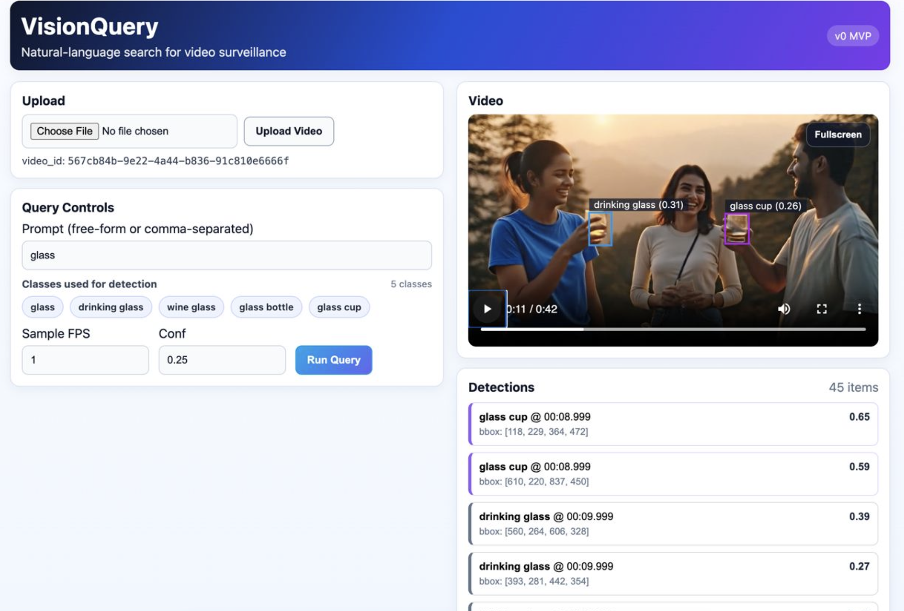
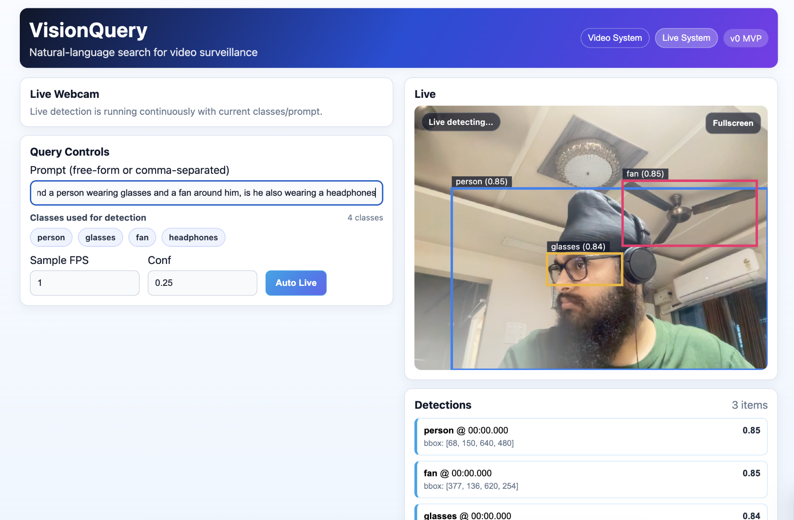

# VisionQuery v0

Minimal monorepo prototype:

- **Backend**: FastAPI + YOLO-World v2 (frame-sampled detection only)
- **Frontend**: React (Vite)

Supports:

- Upload video
- Enter comma-separated prompt (e.g. `person, knife`)
- Sample frames at requested FPS and run YOLO-World v2 detection
- Show detections and click-to-seek in the video player

No tracking, embeddings, async jobs, or exports.

## Output Screenshots

### Video Upload Mode


### Live Webcam Mode


## Run (Backend)

```bash
cd visionquery/backend
python3 -m venv .venv
source .venv/bin/activate
pip install -r requirements.txt
uvicorn main:app --reload --port 8000
```

The first run will download the YOLO-World weights automatically.

## Run (Frontend)

```bash
cd visionquery/frontend
npm install
npm run dev
```

Open the app at `http://localhost:5173`.

### Optional: set backend URL

By default the frontend calls `http://localhost:8000`.

You can override:

```bash
export VITE_BACKEND_URL="http://localhost:8000"
```

# VisionQuery
ChatGPT for Video Surveillance
